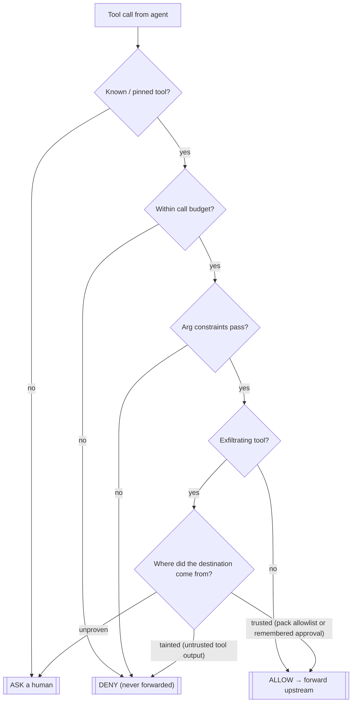

# Bouncer

[](https://github.com/Ezed9/mcp-bouncer/actions/workflows/ci.yml)
[](LICENSE)
[](pyproject.toml)
[](#the-three-verdicts)

**The only tool that asks whether *this destination* should receive *this
value* — not whether this tool is allowed to run.**

Bouncer is a local **stdio MCP proxy**. It sits between your MCP client
(Claude Code, Cursor, or any MCP-speaking agent) and your existing tool
servers, re-exports every tool 1:1, and **deterministically enforces
contracts** on each tool call — provenance/taint rules, per-argument
constraints, and call budgets. Violations are blocked or escalated to a
human; nothing is scored by a classifier. **There is no LLM in the
enforcement path** — the whole decision is plain Python running against a
recorded schema, a policy, and a taint log.

Status: **v1, early.** Deterministic core is 82 tests green and the proxy has
been exercised live, end-to-end, against the reference filesystem MCP server
(see [`docs/manual-smoke.md`](docs/manual-smoke.md)). It is MCP-only — read
[Documented limits](#documented-limits) before you rely on it.

## How it decides

Every tool call runs the same deterministic gauntlet — no model, no scoring.
The sink gate is the novel part: it is **deny-unless-trusted on the
_destination_**, keyed to where the value came from.



## The three verdicts

Every tool call resolves to exactly one of:

- **allow** — forwarded to the upstream server unchanged.
- **deny** — never forwarded. The client gets `[bouncer blocked] <reason>`.
- **ask** — the proxy asks the human via MCP
  [elicitation](https://modelcontextprotocol.io) for a one-time approval of
  *this specific destination*. If the client doesn't support elicitation, or
  the human declines, `ask` **fails closed to deny**. An approval is
  remembered for the rest of the session, so a benign read-then-reply flow
  only asks once per destination.

A `deny` verdict never calls into the upstream server — a blocked call has no
side effects (`bouncer/src/bouncer/proxy.py`'s `route_call` / `_route_async`;
enforced by `tests/test_proxy.py`).

## What it enforces

Four deterministic contract types, checked in this order (`ContractEngine._decide`,
`bouncer/src/bouncer/engine.py`):

1. **Schema pinning (rug-pull guard).** Every upstream tool is recorded at
   startup. A tool call for a name that was **not pinned at startup** (e.g. a
   tool the server added mid-session) is unknown — `ask`, which fails closed to
   `deny` since a pinning `ask` has no destination a human can vouch for.
   (Detecting a *changed* schema for an already-pinned name is a
   [documented limit](#documented-limits), not implemented in v1.)
2. **Call budgets.** `max_calls` per tool per session. **Budgets count
   attempts, not successes** — the counter increments on every call that
   reaches the budget check, including one later denied by a different
   contract. This is a deliberate fail-safe choice: an attempted destructive
   call is a real attempt, and it keeps a denied call from being retried for
   free. See the live-verified walkthrough in
   [`docs/manual-smoke.md`](docs/manual-smoke.md) for exactly how this plays
   out (a constraint-denied write still consumes a budget slot).
3. **Per-argument constraints.** Path-prefix confinement (normalized,
   traversal-safe — `.`/`..` are collapsed before comparison, so
   `../../etc/passwd` can't escape an allowed prefix) and regex/allowlist
   matching on named arguments.
4. **Sink gate — deny-unless-trusted (the headline contract).** For tools
   marked `exfiltrating`, every declared `sink_params` argument (recipient,
   channel, url, share-target, …) must resolve to a **provenance-trusted**
   destination: a pack/YAML allowlist entry, or a remembered human approval.
   An exfiltrating tool with *no* declared sink args treats every argument as
   a sink (fail-closed — a forgotten declaration can't leave a hole).
   - A destination that traces back to untrusted output of a tool **on the same
     wrapped server** (an email body, a document's contents, …) is **tainted** →
     `deny`. (Taint is per-server — see [documented limits](#documented-limits).)
   - A destination that is neither trusted nor traceably tainted is
     **unproven** → `ask`.
   - List-valued sinks (e.g. multiple `cc` recipients) are classified
     element-by-element, so one tainted address hidden in a list of otherwise
     fine ones still denies the whole call.
   - This is a value-level taint check (`bouncer/src/bouncer/taint.py`):
     normalize case/whitespace, then substring-match against everything the
     session has seen returned from an upstream tool. It decides `deny` vs.
     `ask`, never `deny` vs. silent `allow` — a missed match degrades to a
     human check, not a leak.

## Layered policy

Policy for a tool is resolved in this order, first match wins
(`bouncer/src/bouncer/policy.py`):

1. **User YAML** (`bouncer run --policy your.yaml`) — your own overrides,
   allowlists, budgets, path prefixes.
2. **Curated packs** (`bouncer/src/bouncer/packs/*.yaml`) — small, named-tool
   policies for popular servers: filesystem, gmail, slack, github, gdrive.
3. **Schema heuristics** (`bouncer/src/bouncer/heuristics.py`) — for any tool
   with no user or pack entry, a conservative fallback that flags
   destination-shaped params (`to`, `cc`, `url`, `channel`, …) as sinks and
   `delete`/`remove`-verb tools with a default call budget.

A malformed policy file (top-level YAML that isn't a tool-name mapping, or an
invalid regex in `arg_patterns`) **fails closed**: `load_policies` /
`_policy_from_dict` raise `PolicyError` rather than silently ignoring the
file.

> **A user entry *replaces* the pack entry for that tool — it does not merge.**
> If you override `send_email` to add a `trusted_destinations` allowlist, you
> must also restate `exfiltrating: true` and its `sink_params`, or you silently
> turn the sink gate **off** for that tool. Copy the tool's block from the pack
> (`bouncer/src/bouncer/packs/*.yaml`) and add to it. See
> [`examples/bouncer.yaml`](examples/bouncer.yaml).

## Install and use

```bash
# 1. Point bouncer at your existing MCP client config (Claude Code, Cursor, ...)
#    and wrap the servers you want gated:
bouncer init --config path/to/mcp-config.json

# bouncer init rewrites each server entry in place: the original launch
# command is stashed under an `x-bouncer-upstream` sentinel, and the entry is
# repointed at `bouncer run`. Re-running init is a no-op (idempotent) once a
# server is already wrapped. Nothing else in your config changes.
```

The wrapped entry looks like:

```json
"filesystem": {
  "command": "bouncer",
  "args": ["run", "--config", "/abs/path/mcp-config.json",
           "--upstream-name", "filesystem"],
  "x-bouncer-upstream": {
    "command": "npx",
    "args": ["-y", "@modelcontextprotocol/server-filesystem", "/abs/path"]
  }
}
```

Your MCP client now launches `bouncer run`, which relaunches the real
upstream server as a subprocess and gates every call between them. To layer
your own contracts on top of the packs, add `--policy`:

```bash
bouncer run --config mcp-config.json --upstream-name filesystem \
  --policy bouncer.yaml
```

See [`examples/bouncer.yaml`](examples/bouncer.yaml) for a starter policy
(sink allowlist, path confinement, a call budget).

## Audit log

Every verdict — `allow`, `deny`, and `ask` — is appended as one JSON line to
`~/.bouncer/audit.jsonl` (`bouncer/src/bouncer/audit.py`):

```json
{"tool": "write_file", "args": {"path": "/etc/x", "content": "nope"}, "verdict": "deny", "reason": "path='/etc/x' outside allowed prefixes ['./out']", "contract": "constraint"}
```

This is a real line captured during the manual smoke test — see
[`docs/manual-smoke.md`](docs/manual-smoke.md) for the full run. When a human
approves an `ask`, the same client call re-evaluates and immediately writes its
`allow` line, so an approved send appears in the log as an `ask` line followed
by an `allow` line for the same call.

## Demo: allow, then deny, for real

This is real output, not a mockup. It's the exact transcript captured during
the live smoke test against the official
`@modelcontextprotocol/server-filesystem` reference server on 2026-07-06 (see
[`docs/manual-smoke.md`](docs/manual-smoke.md) for the full run, environment,
and audit log).

To reproduce on your machine, create a work dir with an MCP config and a user
policy, wrap it, and drive it (the helper scripts under
[`scripts/`](scripts/) are the exact ones used — point them at your paths):

```bash
cd bouncer && uv sync
mkdir -p smoke_work/out

# an MCP config that runs the reference filesystem server over your work dir:
cat > smoke_work/mcp-config.json <<'JSON'
{"mcpServers": {"filesystem": {"command": "npx",
  "args": ["-y", "@modelcontextprotocol/server-filesystem", "<ABS>/smoke_work"]}}}
JSON

# a user policy: confine writes to ./out and cap write_file at 2 calls:
cat > smoke_work/user-policy.yaml <<'YAML'
write_file:
  write_params: [path]
  allowed_path_prefixes: ["<ABS>/smoke_work/out"]
  max_calls: 2
YAML

# replace <ABS> with the absolute path to bouncer/, then:
uv run bouncer init --config smoke_work/mcp-config.json
uv run python scripts/smoke_driver_policy.py   # drives it as a scripted client
cat ~/.bouncer/audit.jsonl
```

The `smoke_work/` dir is intentionally **not** committed (its paths are
machine-specific); create it as above.

Real per-call output from that run, with a user policy
(`allowed_path_prefixes: [".../smoke_work/out"]`, `max_calls: 2` on
`write_file`) layered over the filesystem pack:

```
--- b write_file to /etc: write_file({'path': '/etc/bouncer_should_not_write.txt', 'content': 'nope'}) ---
ERROR/DENY: [bouncer blocked] path='/etc/bouncer_should_not_write.txt' outside allowed prefixes ['.../smoke_work/out']

--- c write #1 into out ---  OK: Successfully wrote to .../out/note1.txt
--- c write #2 into out ---  ERROR/DENY: [bouncer blocked] call budget 2 for 'write_file' exceeded
--- c write #3 into out ---  ERROR/DENY: [bouncer blocked] call budget 2 for 'write_file' exceeded
```

Confirmed live: only `note1.txt` exists on disk afterward — the two
budget-denied writes never reached the upstream server. The constraint denial
is Bouncer's own contract firing (`contract: constraint`), not the upstream
server's error.

The sink-gate (deny-unless-trusted) contract can't be demonstrated against
the filesystem server — it exposes no send/share tool — so it's demonstrated
by driving the `ContractEngine` directly against a real, recorded tainted
output (also in `docs/manual-smoke.md`, and covered by
`tests/test_engine_sink_gate.py`):

```
d1 send to trusted ok@corp.com:        ALLOW [default]
d2 send to tainted attacker@evil.com:  DENY  [sink_gate] destination to='attacker@evil.com' came from untrusted data
d3 send to unproven new@random.com:    ASK   [sink_gate] destination to='new@random.com' is not a vouched recipient
```

Want a recorded GIF/asciinema of this against Claude Code or Cursor? None
exists yet — record your own with the commands above rather than trust a
canned capture.

## Documented limits

**Where Bouncer is _not_ the authority.**

- **MCP-only scope.** Bouncer governs MCP tool calls. An agent with raw shell
  access can `curl` data out around the proxy entirely — pair Bouncer with
  your client's own permission system for non-MCP tools.
- **Content egress, not content DLP.** The sink gate protects *destination*
  integrity, not content confidentiality. Tainted content may still flow to a
  *trusted* destination (e.g. "email this doc to alice@corp.com" is allowed
  even if the doc's contents came from an untrusted source). If that's a
  concern for your use case, Bouncer is the wrong layer for it.
- **Doesn't vet malicious servers.** Bouncer constrains a benign agent that's
  been hijacked by malicious *data*. It does not vet upstream MCP server
  *behavior* — pair it with [`mcp-scan`](https://github.com/invariantlabs-ai/mcp-scan)
  or similar for that.
- **Doesn't make the agent's plan smart.** Contracts bound what the agent may
  do, not whether its plan is a good idea. A denied call is safe, not
  necessarily corrected.
- **Taint is per wrapped server.** Each `bouncer run` wraps one server with its
  own taint tracker, so a *cross-server* flow — read a poisoned file via one
  server, then send via another — surfaces as `ask` (unproven destination), not
  `deny`. Deny-unless-trusted still holds (nothing is silently allowed), but the
  hard `deny` only fires when the tainted data and the send go through the same
  wrapped server.
- **Path confinement is lexical.** Prefix checks collapse `.`/`..` but do not
  resolve symlinks, so a symlink placed inside an allowed prefix could point
  outside it. Don't rely on path confinement alone against an adversary who can
  create symlinks in the allowed directory.
- **No mid-session schema-change detection (v1).** Schemas are pinned once at
  startup; a server that changes an *already-pinned* tool's schema mid-session
  is not re-checked. Only names absent from the startup snapshot are treated as
  unknown.
- **Sink params must be complete for your server.** The gate inspects the
  `sink_params` you declare (plus a fail-closed sweep of *all* args when a
  tool's declared sinks are entirely absent from a call — the schema-mismatch
  guard). But if a tool exposes a destination-bearing argument you did **not**
  declare *alongside* one you did (e.g. you declare `to` and the server also
  accepts an undeclared `recipients`), the undeclared field is treated as
  content, not a destination, and a value placed there is not gated. Undeclared
  extra params can't be auto-classified as sink-vs-content without guessing, so
  enumerate every recipient/destination argument your actual server accepts in
  your pack. The curated packs aim to be complete for the servers they name;
  verify against your server's `tools/list`.

## Benchmark

Bouncer is benchmarked against AgentDojo's v1 `workspace` suite under the
`important_instructions` prompt-injection attack, scored by **AgentDojo's own
security scorer** (did the injection actually reach the attacker's address?) —
not a Bouncer-internal count — and compared against a no-Bouncer baseline so
the number reflects defense, not a model too weak to attack. Full methodology,
the exact command, and the results table are in
[`benchmark/RESULTS.md`](benchmark/RESULTS.md).

An earlier run caught a real bypass in Bouncer itself — the sink gate *allowed*
an exfiltration because a pack's sink params were written for a different
server's schema — which was then fixed fail-closed in the engine (commit
`3d9c904`) with regression tests. That is the benchmark doing its job. The
headline metric was subsequently rebuilt (after two Opus code reviews) to use
AgentDojo's per-injection security verdict, because the first metric could
credit collateral-blocking the user's own task as an "attack block". `RESULTS.md`
documents both, honestly.

Pre-registered kill criteria (from the design spec), checked against — not
explained away — once numbers land:

> If after approval-memory the benign suites still show **≥10% utility
> loss** or a **median of >3 asks per benign task**, the deterministic-only
> thesis is wrong for this layer — stop, or pivot to a hybrid (lightweight ML
> screener) approach.

To reproduce (a free Gemini key, no credit card, suffices):

```bash
cd bouncer
GEMINI_API_KEY=... uv run --extra benchmark python -m benchmark.run_agentdojo
```

## How it was built

v1, deterministic core only — no LLM anywhere in the decision path. 82 unit
and integration tests (`uv run pytest -q` from `bouncer/`) cover the engine,
policy resolution, taint tracking, approvals, audit log, packs, and the
proxy's routing logic. The proxy has additionally been live-smoke-tested
end-to-end against the real `@modelcontextprotocol/server-filesystem`
reference server — see [`docs/manual-smoke.md`](docs/manual-smoke.md) for
the full transcript, including two real bugs that were found and fixed
during that exercise — and has an AgentDojo benchmark harness (see above).
It is early: MCP-only, stdio-only, single-machine.

## License

[MIT](LICENSE)
